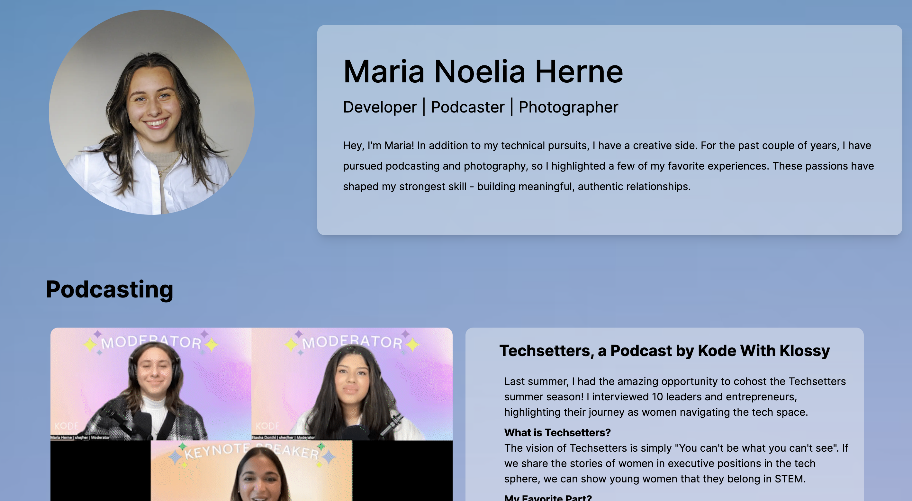
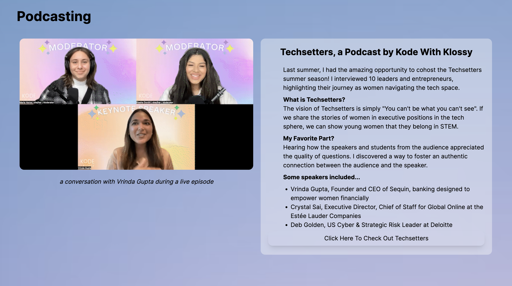

# Maria Noelia Herne

**Welcome to my personal website!** This simple website is a reflection of my passion for **photography** and **podcasting**, combined with my technical skills in building web applications using **Tailwind CSS**, **HTML**, and **CSS**.

## Technologies Used

- **Tailwind CSS**: The website's design is powered by Tailwind CSS, enabling me to quickly style and customize components for a polished look.

## Demo

## Future Iterations:

I plan on adding more dynamic elements using **React**, such as a navigation bar that scrolls to sections of the website. I also will make the website mobile-friendly with features such as a carousel for the photos in the portfolio.

## How to Run the Project Locally

Currently, I am working to deploy the website on github pages. In the meantime, if you would like to explore the website locally, follow these steps:

1. Clone the repository.
2. Navigate to the project folder and install dependencies using `npm install`.
3. Run the development server with `npm start`.
4. Access the website at `http://localhost:3000` in your web browser.

Thank you for checking this out!
**Maria Noelia Herne**
